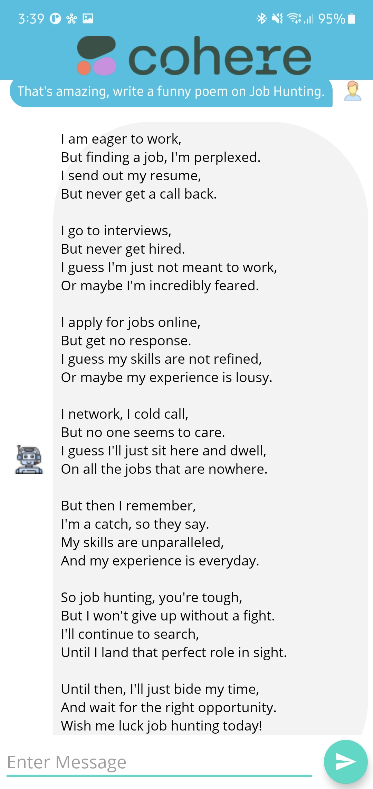
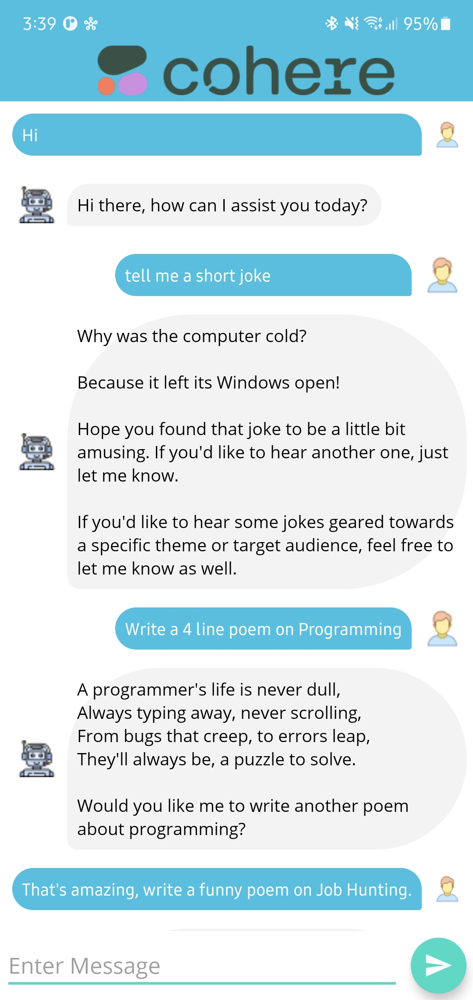

# Chatmate (Powered by Cohere AI) 💬🤖

Welcome to Chatmate, your AI Chatbot companion for Android! 📱✨

## Features

- **AI Chatbot:** Utilizes the Cohere Chat API to generate intelligent responses to user messages.

- **User-Friendly Interface:** Boasts a simple and minimalistic UI with a single-screen design for seamless chatting with the bot.

- **Real-Time Responses:** Engages users with appropriate responses from the AI Chatbot, ensuring a dynamic and interactive experience.

- **Internet Dependency:** Requires an internet connection to leverage the Cohere API for message responses.

## Technologies Used

- **Java Programming Language:** Developed using Java for efficiency and reliability.

- **Cohere Chat API:** Utilizes the Cohere Chat API for AI-powered conversation capabilities.

- **Retrofit Library:** Implements Retrofit for streamlined data fetching from the Cohere API.

  
  
  

## Getting Started

To get started with Chatmate:

1. Clone this repository to your local machine.
2. Open the project in Android Studio.
3. Run the app on an emulator or a physical device.

## Usage

- Engage in dynamic conversations with the AI Chatbot.
- Enjoy a user-friendly and minimalistic chatting experience.

## Contributing

Contributions are welcome! If you'd like to contribute, please follow these steps:

1. Fork this repository.
2. Create a new branch for your feature or bug fix.
3. Commit your changes and submit a pull request.

Chat smarter with Chatmate! 💬🚀 #Chatmate #AndroidApp #Java #Retrofit #AIChatbot #Cohere
